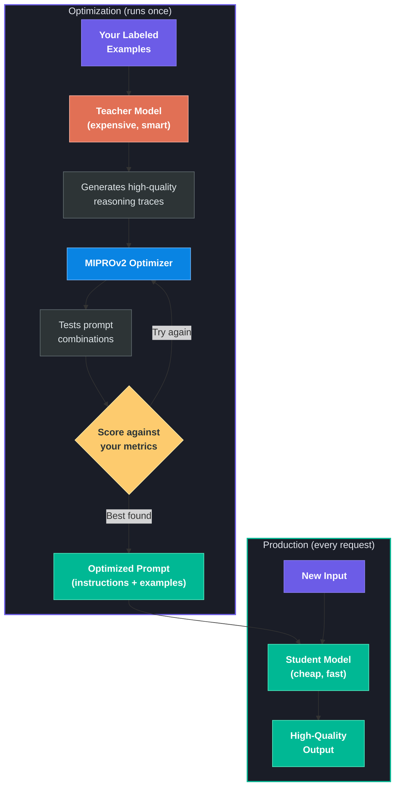
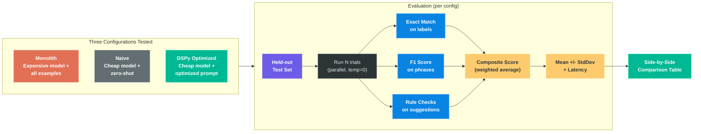

# User Guide

## What This Tool Does

This tool helps you get high-quality results from cheap, fast AI models without manually writing prompts.

The problem: an expensive model does your task well, but it's slow and costly. A cheap model is fast and affordable, but gets the task wrong without a carefully crafted prompt.

This tool **automatically finds the best prompt** for the cheap model:

1. A smart "teacher" model generates high-quality examples of the task being done well
2. The optimizer tests different combinations of instructions and examples
3. Everything is scored against your evaluation metrics
4. You get the winning prompt that works with any API

You run the optimization once. After that, deploy the cheap model with the optimized prompt.

### How Optimization Works



## Field Reference

### Task Configuration

| Field | What It Does |
|-------|-------------|
| **Task Name** | A label for saving/loading. Example: "Brand Voice Compliance - Liquid Death" |
| **Description** | One-sentence description that becomes the system prompt preamble. Be specific. |
| **Guidelines** | Rules, context, or reference material the model needs. Included in every prompt. |

### Signature Fields

These define the model's input/output contract.

| Type | Purpose | Example |
|------|---------|---------|
| **Input Fields** | What the model receives per request. Each has a name and description. | `marketing_copy` - "The marketing copy to check" |
| **Output Fields** | What the model produces. These get scored by metrics. | `compliant` - "true if on-brand, false if not" |

> **Tip:** Keep names snake_case. Descriptions matter -- "comma-separated list" vs "JSON array" produce very different outputs.

### Evaluation Metrics

Metrics define how the model's output is scored. The optimizer uses these to find the best prompt.

| Metric Type | What It Does | Best For |
|-------------|-------------|----------|
| **Exact Match** | Case-insensitive string comparison. 1.0 if match, 0.0 if not. | Classification fields (true/false, categories) |
| **F1 Phrases** | Parses comma-separated phrases, computes precision/recall/F1 with fuzzy matching. | Fields listing multiple items (flagged phrases, entities) |
| **Rule Quality** | Checks text against structural rules: banned words, max sentence length, passive voice. | Free-text outputs that must follow specific rules |
| **Custom** | Write your own Python function: `def metric(example, pred, trace=None) -> float` | Anything the built-ins don't cover |

Each metric has a **weight** (how much it matters) and a **target field** (which output it scores).

### Training Data

Labeled examples the optimizer learns from. Each row needs values for ALL fields (inputs and outputs).

The data is automatically split:
- **Train** -- the optimizer picks the best few-shot examples from these
- **Validation** -- the optimizer scores candidate prompts against these
- **Test** -- never seen during optimization, used for the final honest evaluation

> Aim for 30-50 examples minimum. Include a mix of cases.

### Model Configuration

| Field | What It Does |
|-------|-------------|
| **Teacher Model** | Smart, expensive model used during optimization only. Generates demonstrations. Example: `gemini/gemini-3.1-pro-preview` |
| **Student Models** | Cheap, fast models for production. The optimizer finds the best prompt for each. Example: `gemini/gemini-2.5-flash-lite` |
| **Eval Trials** | How many evaluation runs per config. More = stabler numbers. Default 10, use 30+ for presentations. |
| **Threads** | Parallel API calls. Default 50 works well for Gemini. |

## Available Tasks

The tool comes with three pre-built tasks. Select one from the task bar at the top.

### 1. Brand Voice Compliance (Liquid Death)

Given marketing copy and brand guidelines, check if the copy is on-brand. Flags problematic phrases, suggests replacements. Single-stage module, 53 examples.

### 2. Persona Adherence

Given a persona's scraped messages and a conversation thread, generate an in-character reply. Single-stage module. 36 examples across 4 personas (snarky tech bro, warm grandma, corporate exec, gen-z meme enthusiast). Metrics: vocabulary overlap, sentence length similarity, formality delta, response relevance.

### 3. Multi-Source Research Synthesizer

Given multiple source documents and a research question, produce a structured synthesis. **Multi-hop module** (3 stages: extract per source, cross-reference, format output). MIPROv2 optimizes all 3 stages jointly. 10 research scenarios with planted findings and contradictions. The production prompt for this task contains 3 separate stage prompts.

## Walkthrough

### Step 1: Select a task

Click a task button at the top (e.g., "brand voice liquid death"). This loads the full config: guidelines, fields, metrics, and labeled examples. You can edit anything after loading.

### Step 2: Configure models

Pick a teacher model (expensive, used only during optimization) and one or more student models (cheap, deployed in production). Defaults work well for Gemini.

### Step 3: Run Optimization

Click "Run Optimization". The pipeline:
1. Evaluates the teacher model with all examples (monolith baseline)
2. Evaluates each student model zero-shot (naive baseline)
3. Runs MIPROv2 to find the best prompt for each student
4. Evaluates each student with the optimized prompt

Takes a few minutes. Progress bar updates as each step completes.

### Step 4: Read Table 1 (original results)

Three columns per student model:
- **Monolith**: expensive model. The quality ceiling.
- **Naive**: cheap model, no optimization. The floor.
- **DSPy**: cheap model with optimized prompt. Should match or beat monolith.

Green = best in that row.

### Step 5: View production prompts

Below the results, each student model's optimized prompt is shown in a textarea. Copy to clipboard or download as .txt. Use with any LLM API -- no DSPy needed in production.

## Edit & Re-evaluate (Human-in-the-Loop)

After the experiment runs, you can edit any column's prompt and re-evaluate.

1. **Open "Edit & Re-evaluate"** -- tabs for each column (Monolith, Naive, DSPy)
2. **Edit the prompt** -- rewrite instructions, remove demos, add rules
3. **Click "Re-evaluate All Edits"** -- fast eval pass, no optimization
4. **Table 2 appears** below Table 1 with edited results + green/red deltas

This is the "creative director" workflow. DSPy does the heavy lifting, then a human fine-tunes. The deltas show exactly whether edits helped or hurt.

> **Typical finding:** Manual edits to the DSPy-optimized prompt either match or slightly degrade performance, validating that automatic optimization is hard to beat.

## How Evaluation Works



Each configuration is evaluated N times on data never seen during optimization. Results are reported as mean +/- standard deviation.

### Reading the results

| Value | Meaning |
|-------|---------|
| **composite** | Overall score -- weighted average of all metrics. The single number to compare. |
| **Individual metrics** | Each metric you defined. Shows WHERE the model struggles. |
| **latency** | Average response time (ms). Optimized may be slightly slower than naive (longer prompt) but much faster than monolith. |
| **+/-** | Standard deviation across eval trials. Small = stable. Large = model output varies between runs. |
| **Green highlight** | Best score in that row. For latency, lowest (fastest) is highlighted. |

## CLI Usage

The CLI demo uses the same engine as the web UI:

```bash
# Default task (brand voice)
uv run demo.py

# Different task
uv run demo.py --task tasks/persona_adherence.json

# Multi-hop task
uv run demo.py --task tasks/research_synthesizer.json

# Quick test (fewer trials)
uv run demo.py --trials 3

# Custom models
uv run demo.py --teacher openai/gpt-4.1 --students gemini/gemini-2.5-flash-lite openai/gpt-4.1-nano
```

## Adding a New Task (Developer Guide)

To add a new pre-built task, fork the repo and:

1. **Create a module** in `core/modules/` -- a `dspy.Module` subclass. For single-stage tasks, copy `brand_voice.py`. For multi-hop, see `research_synthesizer.py`.
2. **Register it** in `core/modules/__init__.py` with a `module_key`.
3. **Create a task JSON** in `tasks/` with fields, metrics, examples, and `module_key`.
4. The web UI and CLI automatically pick it up.

**Files that stay the same:** `core/engine.py`, `server/`, `static/`, `core/metrics_builtin.py`. The plumbing is task-agnostic.
