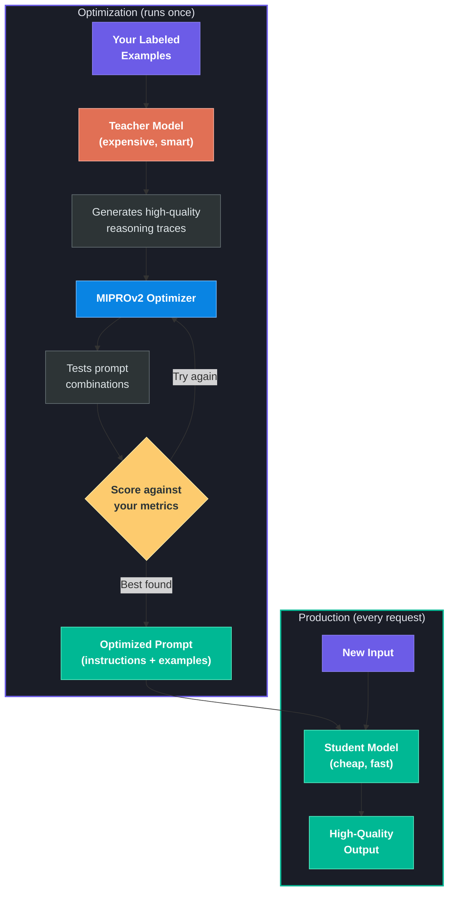
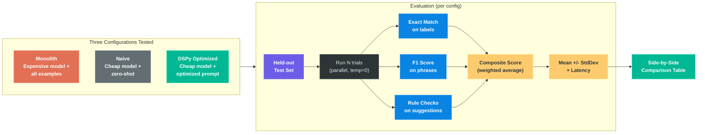

# User Guide

## What This Tool Does

This tool helps you get high-quality results from cheap, fast AI models without manually writing prompts.

The problem: an expensive model does your task well, but it's slow and costly. A cheap model is fast and affordable, but gets the task wrong without a carefully crafted prompt.

This tool **automatically finds the best prompt** for the cheap model:

1. A smart "teacher" model generates high-quality examples of the task being done well
2. The optimizer tests different combinations of instructions and examples
3. Everything is scored against your evaluation metrics
4. You get the winning prompt that works with any API

You run the optimization once. After that, deploy the cheap model with the optimized prompt.

### How Optimization Works

## Field Reference

### Task Configuration

| Field | What It Does |
|-------|-------------|
| **Task Name** | A label for saving/loading. Example: "Brand Voice Compliance - Liquid Death" |
| **Description** | One-sentence description that becomes the system prompt preamble. Be specific. |
| **Guidelines** | Rules, context, or reference material the model needs. Included in every prompt. |

### Signature Fields

These define the model's input/output contract.

| Type | Purpose | Example |
|------|---------|---------|
| **Input Fields** | What the model receives per request. Each has a name and description. | `marketing_copy` - "The marketing copy to check" |
| **Output Fields** | What the model produces. These get scored by metrics. | `compliant` - "true if on-brand, false if not" |

> **Tip:** Keep names snake_case. Descriptions matter -- "comma-separated list" vs "JSON array" produce very different outputs.

### Evaluation Metrics

Metrics define how the model's output is scored. The optimizer uses these to find the best prompt.

| Metric Type | What It Does | Best For |
|-------------|-------------|----------|
| **Exact Match** | Case-insensitive string comparison. 1.0 if match, 0.0 if not. | Classification fields (true/false, categories) |
| **F1 Phrases** | Parses comma-separated phrases, computes precision/recall/F1 with fuzzy matching. | Fields listing multiple items (flagged phrases, entities) |
| **Rule Quality** | Checks text against structural rules: banned words, max sentence length, passive voice. | Free-text outputs that must follow specific rules |
| **Custom** | Write your own Python function: `def metric(example, pred, trace=None) -> float` | Anything the built-ins don't cover |

Each metric has a **weight** (how much it matters) and a **target field** (which output it scores).

### Training Data

Labeled examples the optimizer learns from. Each row needs values for ALL fields (inputs and outputs).

The data is automatically split:
- **Train** -- the optimizer picks the best few-shot examples from these
- **Validation** -- the optimizer scores candidate prompts against these
- **Test** -- never seen during optimization, used for the final honest evaluation

> Aim for 30-50 examples minimum. Include a mix of cases.

### Model Configuration

| Field | What It Does |
|-------|-------------|
| **Teacher Model** | Smart, expensive model used during optimization only. Generates demonstrations. Example: `gemini/gemini-3.1-pro-preview` |
| **Student Models** | Cheap, fast models for production. The optimizer finds the best prompt for each. Example: `gemini/gemini-2.5-flash-lite` |
| **Eval Trials** | How many evaluation runs per config. More = stabler numbers. Default 10, use 30+ for presentations. |
| **Threads** | Parallel API calls. Default 50 works well for Gemini. |

## Walkthrough: Default Task

### Step 1: Load the default task

Click "Default Task" and check "Use default synthetic data". This pre-fills everything with the Liquid Death brand voice example: guidelines, fields, metrics, and 53 labeled examples.

### Step 2: Review what's configured

- **Guidelines**: Liquid Death's brand voice rules -- irreverent, anti-corporate, punk. Banned phrases like "premium quality", "leverage". Preferred alternatives like "purchase" becomes "grab".
- **Input**: `marketing_copy` -- the text to check
- **Outputs**: `compliant` (true/false), `flagged_phrases` (what's wrong), `suggestion` (the fix)
- **Metrics**: Exact match on compliance (40%), F1 on flagged phrases (30%), rule quality on suggestions (30%)

### Step 3: Check model configuration

Defaults:
- **Teacher**: `gemini/gemini-3.1-pro-preview` ($2.00/M tokens)
- **Student**: `gemini/gemini-2.5-flash-lite` ($0.10/M tokens)

### Step 4: Click "Run Optimization"

The pipeline runs:
1. Evaluates the teacher model with all examples (monolith baseline)
2. Evaluates the student model zero-shot (naive baseline)
3. Runs MIPROv2 to find the best prompt for the student
4. Evaluates the student with the optimized prompt

Takes a few minutes. Progress bar updates as each step completes.

### Step 5: Read the results

The results table shows three columns per student model:
- **Monolith**: expensive model doing the task. The quality ceiling at highest cost.
- **Naive**: cheap model with no optimization. The floor.
- **DSPy**: cheap model with the optimized prompt. Should be close to monolith at a fraction of the cost.

Green = best in that row. You want DSPy to match or beat the monolith.

### Step 6: Download the production prompt

Click the download button to get a `.txt` file containing:
- **System instructions** -- use as your system prompt in any API
- **Few-shot examples** -- include in the conversation
- **User message template** -- where you insert each new request

Works with any LLM API. No DSPy dependency needed in production.

## How Evaluation Works

Each configuration is evaluated N times on data never seen during optimization. Results are reported as mean +/- standard deviation.

### Reading the results

| Value | Meaning |
|-------|---------|
| **composite** | Overall score -- weighted average of all metrics. The single number to compare. |
| **Individual metrics** | Each metric you defined. Shows WHERE the model struggles. |
| **latency** | Average response time (ms). Optimized may be slightly slower than naive (longer prompt) but much faster than monolith. |
| **+/-** | Standard deviation across eval trials. Small = stable. Large = model output varies between runs. |
| **Green highlight** | Best score in that row. For latency, lowest (fastest) is highlighted. |

## Creating a Fresh Task

1. Click "Fresh Task" -- clears the form
2. Fill in name, description, and guidelines
3. Add input fields (what goes in) and output fields (what comes out)
4. Add one metric per output field with appropriate type and weight
5. Add 30-50 labeled examples via "+ Add Row" or "Import CSV"
6. Pick teacher and student models
7. Run and iterate

### Common Pitfalls

- **Too few examples** (<20) -- the optimizer doesn't have enough signal
- **Vague output descriptions** -- the model guesses format instead of following it
- **Missing metrics on output fields** -- the optimizer ignores un-scored fields
- **Inconsistent labeling** -- "True" vs "true" vs "yes" confuses exact match

## Adapting for a Different Task (Developer Guide)

If you want to fork this repo and adapt it for a completely different task without using the web UI:

**Files that change** (the task-specific parts):
- `brand/guidelines.py` -- swap in your domain's rules and context
- `brand/trainset.py`, `brand/valset.py`, `brand/testset.py` -- new labeled examples
- `metrics.py` -- new scoring logic for your outputs
- `demo.py` -- update the `BrandCompliance` signature and `BrandComplianceChecker` module

**Files that stay the same** (the DSPy plumbing):
- `core/` -- the entire engine, metric factories, signature builder
- `server/` -- the entire web server
- `static/` -- the entire frontend

Or just use the web UI's "Fresh Task" mode and skip editing code entirely.
